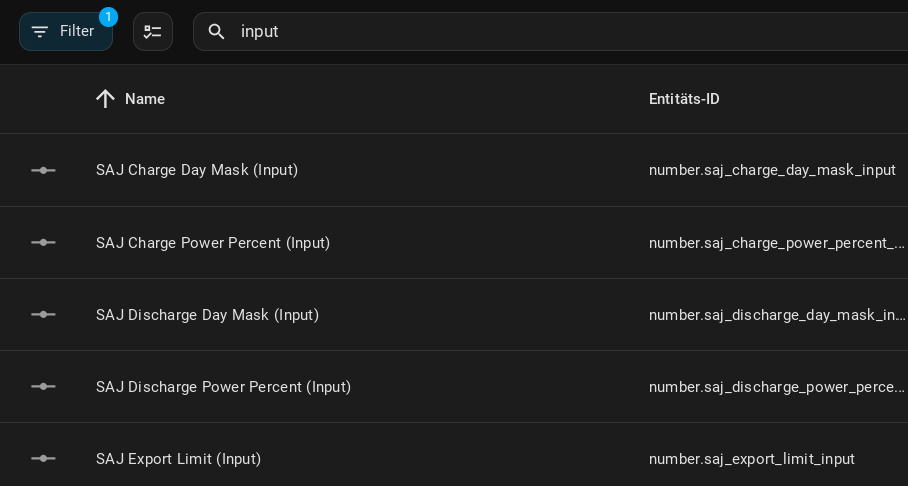
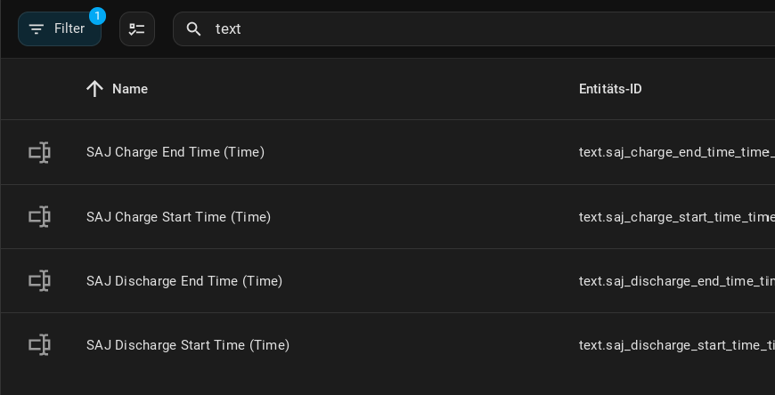
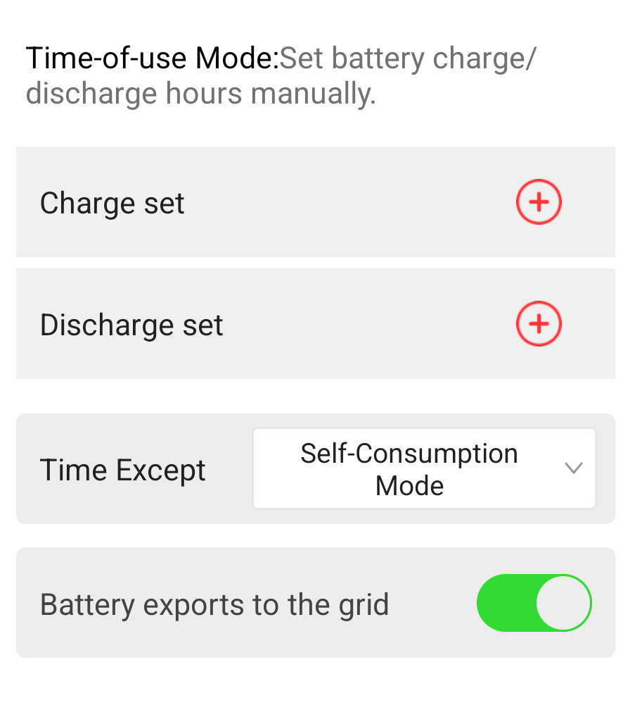

[](https://github.com/hacs/default)[](https://github.com/stanus74/home-assistant-saj-h2-modbus/releases)[](https://github.com/stanus74/home-assistant-saj-h2-modbus/releases)  
[](https://buymeacoffee.com/stanus74)


# SAJ H2 Inverter Modbus - A Home Assistant integration for SAJ H2 Inverters

## <span style="color:red;">New Feature added: "Charge battery with mains power", see the Features section below</span>

Integration for reading data from SAJ Inverters through Modbus TCP.

Implements SAJ H2/HS2 Inverter registers from [SAJ H2-Protocol](https://github.com/stanus74/home-assistant-saj-h2-modbus/blob/main/saj-h2-modbus.zip)

It should work for Ampere Solar Inverter (EKD-Solar) too. They use SAJ HS2 Inverter.

## Features

- Installation through Config Flow UI
- Over 220 registers (power, energy, temperature sensors, battery...)
- Configurable polling interval - changeable at any time
- Smart Modbus connection management - especially for AIO3

- **New Feature:** Configure Charging Time and Power, ability to switch the working mode between **Self-Consumption** / **Time-of-Use Mode** (to charge the battery with grid power) 

## Installation

This integration is NOT available in the HACS default repository. (the inclusion in HACS has been requested)

1. Open HACS and click the three dots in the top right corner.
2. Select "Custom repositories," then enter the GitHub URL https://github.com/stanus74/home-assistant-saj-h2-modbus
3. Choose "Integration" and click "Add."
4. Find "SAJ H2 Inverter Modbus" and click "Install."
5. Restart Home Assistant.
6. After reboot of Home-Assistant, this integration can be configured through the integration setup UI


## Configuration

1. Navigate to the "Integrations" page in your configuration, then click "Add Integration" and select "SAJ H2 Modbus."
2. Enter the IP Address and Interval.
3. Optional: Setting the charge values for charging the battery from the grid >[read the instructions](https://github.com/stanus74/home-assistant-saj-h2-modbus/blob/main/working-mode-doc.pdf)
4. Set charging values in Home Assistant, see below
5. (optional) set input_numbers in configuration.yaml > see in Section "***Using Input Number Entities**"

---

## Features


### 🚀 Working Mode Control (Advanced Users, new since Version 2.1)

This version adds support for controlling the working mode of the inverter. This feature is intended for advanced users.
see in [CHANGELOG](https://github.com/stanus74/home-assistant-saj-h2-modbus/blob/main/CHANGELOG.md)


### 🚀 Export Limit Control

- **SAJ Export Limit (Input)**
  Value in **percent** – e.g. `500` = 50% of inverter max power (e.g. 4000 W for 8 kW inverter)

#### Sensors:
- **SAJ Anti-Reflux Power Limit** (`365AH`) – changeable with Export Limit (Input)
- **SAJ Anti-Reflux Current Limit** (`365BH`)
- **SAJ Anti-Reflux Current Mode** (`365CH`)

Perfect for zero export or dynamic grid feed-in limitation.


### Configure Charging and Discharging Time and Power


**You can set the Inverter to "Time-of-Use" Mode with this switch.**

Enable this switch to charge/discharge the battery - individually or both.




- **Day Mask**: This is a bitmask to select charging days (e.g., Monday to Sunday = 127, calculated as 1 + 2 + 4 + 8 + 16 + 32 + 64).
- **Charging/Discharging Power**: The power is set as a percentage of the inverter’s maximum capacity. For example, 10% of an 8000-watt inverter equals 800 watts. **Note**: The integration limits charging power to a maximum of 25%.





**To discharge from the battery, you must enable the 'Export' switch in the SAJ App under 'Working Mode' > 'Time-of-Use'.**





### Important! The status of Input-Registers and mode will be updated after 1 interval


## Using Input Number Entities

This integration supports the use of `input_number` entities to provide a better user interface for numeric settings. These entities can be displayed directly in your dashboard and are easier to use than navigating through the entities view.

### With Input Number Entities (Recommended)

To use `input_number` entities, add the following to your `configuration.yaml`:

```yaml
input_number:
  saj_charge_day_mask:
    name: SAJ Charge Day Mask
    min: 0
    max: 127
    step: 1
    mode: box
    icon: mdi:calendar
    
  saj_charge_power_percent:
    name: SAJ Charge Power Percent
    min: 0
    max: 25
    step: 1
    mode: box
    icon: mdi:flash
    
  saj_discharge_day_mask:
    name: SAJ Discharge Day Mask
    min: 0
    max: 127
    step: 1
    mode: box
    icon: mdi:calendar
    
  saj_discharge_power_percent:
    name: SAJ Discharge Power Percent
    min: 0
    max: 100
    step: 1
    mode: box
    icon: mdi:flash
    
  saj_export_limit:
    name: SAJ Export Limit
    min: 0
    max: 1000
    step: 100
    mode: box
    icon: mdi:flash-outline
    
  saj_app_mode:
    name: SAJ App Mode
    min: 0
    max: 3
    step: 1
    mode: box
    icon: mdi:information-outline
```


## Additional Information

The data from the SAJ H2 inverter is transmitted to the SAJ server via a WiFi interface, AIO3.

The AIO3 may have port 502 open, allowing us to access the Modbus data. The IP address can be determined in the router. 

There are also reports of **AIO3 devices with port 502 closed**. Then you need to have an RS232-wifi or -ethernet converter.

OR reset the AIO3 and reconfigure it, **important**: it must be given **a new IP address**. Then check with a port scanner if port 502 is open

[](https://buymeacoffee.com/stanus74)