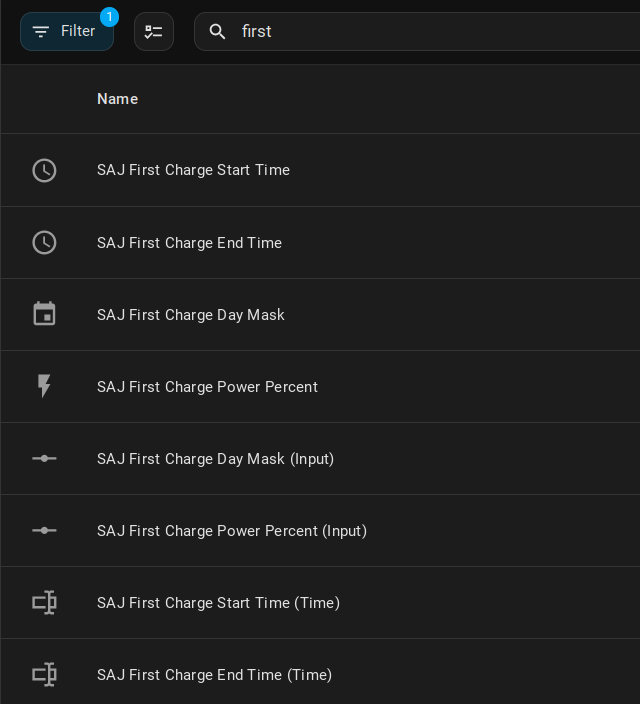
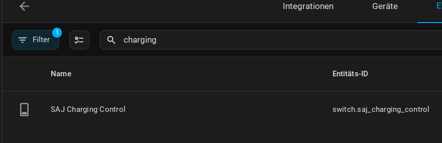

  

# SAJ H2 Inverter Modbus - A Home Assistant integration for SAJ H2 Inverters

## New Feature added: "Charge battery with mains power", see under Features

Integration for reading data from SAJ Inverters through Modbus TCP.

Implements SAJ H2/HS2 Inverter registers from [SAJ H2-Protocol](https://github.com/stanus74/home-assistant-saj-h2-modbus/blob/main/saj-h2-modbus.zip)

It should work for Ampere Solar Inverter (EKD-Solar) too. They use SAJ HS2 Inverter.

## Features

- Installation through Config Flow UI
- Over 190 registers (power, energy, temperature sensors, battery ...)
- Configurable polling interval - changeable at any time
- Smart Modbus connection management - especially for AIO3

- **New Feature:** Configure Charging Time and Power, ability to switch the working mode between **Self-Consumption** / **Time-of-use-Mode** (to charge the battery with grid power) 

## Installation

This integration should be available in the HACS default repository. Simply go to HACS and search for "SAJ H2 Inverter Modbus", click it and click "Download". Don't forget to restart Home-Assistant. After restart, this integration can be configured through the integration setup UI.

## Configuration

1. Navigate to the "Integrations" page in your configuration, then click "Add Integration" and select "SAJ H2 Modbus."
2. Enter the IP Address and Interval.
3. Optional: Setting the charge values for charging the battery from the grid >[read the instructions](https://github.com/stanus74/home-assistant-saj-h2-modbus/blob/main/working-mode-doc.pdf)
4. Set charing values in Home Assistant , see below

---

## New Features Since Version 1.8

### Configure Charging Time and Power

- **What’s New**: The first four sensors display Charging Time, Days, and Power (as a percentage).
- **Day Mask**: This is a bitmask to select charging days (e.g., Monday to Sunday = 127, calculated as 1 + 2 + 4 + 8 + 16 + 32 + 64).
- **Editable Registers**: Entities labeled "(Input)" and "(Time)" can be modified.

**How It Works**: Values are written to the inverter via Modbus at the configured interval (e.g., every 60 seconds).

**Charging Power**: The power is set as a percentage of the inverter’s maximum capacity. For example, 10% of an 8000-watt inverter equals 800 watts.

**Note**: The integration limits charging power to a maximum of 25%.

### Switch between Inverter Modes

- **Feature**: Use the switch to toggle between "Time-of-Use (Charging)" and "Self-Consumption" modes.

### Important! The status and mode will be updated after 1 interval

## Additional Information

The data from the SAJ H2 inverter is transmitted to the SAJ server via a WiFi interface, AIO3.

The AIO3 may have port 502 open, allowing us to access the Modbus data. The IP address can be determined in the router. 

There are also reports of **AIO3 devices with port 502 closed**. Then you need to have an RS232-wifi or -ethernet converter.

OR reset the AIO3 and reconfigure it, **important**: it must be given **a new IP address**. Then check with a port scanner if port 502 is open

