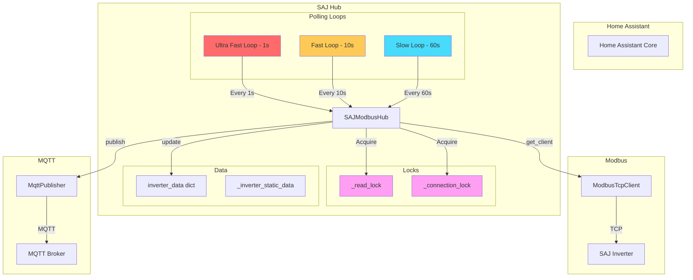
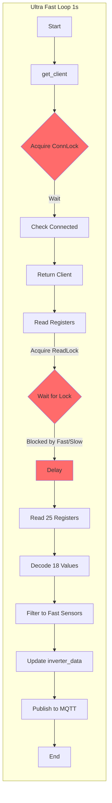
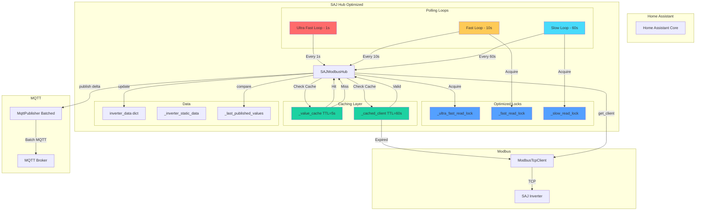
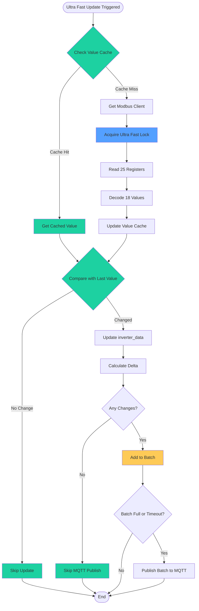
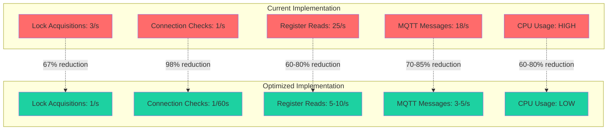
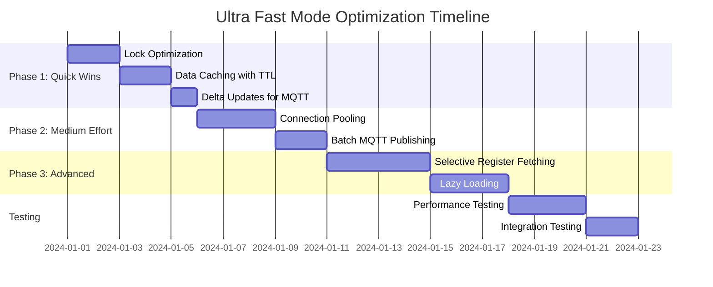

# Ultra Fast Mode Architecture Diagrams

## Current Architecture

## Performance Bottleneck Visualization

## Optimized Architecture

## Optimization Flow Diagram

## Resource Usage Comparison

## Implementation Timeline

